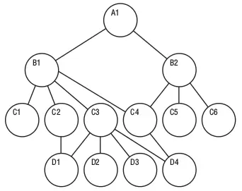
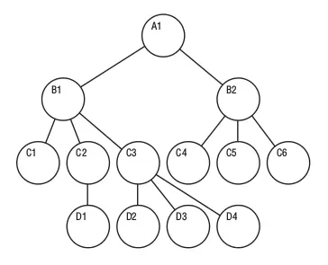

# 데이터베이스

데이터베이스는 전자적으로 저장되는 데이터의 집합이다.

## 중요성

- 효율적인 확장
- 데이터의 무결성
- 데이터 보안
- 데이터 분석

## 데이터베이스의 발전 & 종류

### 계층적 데이터베이스 (Hierarchical)

70년대 인기를 얻었으며, 데이터 레코드를 순차적으로 저장하는 대신 **트리**구조에 보관하여 파일 간의 상위-하위 관계를 설정했다. 계층적 모델은 일대다 관계는 잘 표현하지만, 다대다 관계에는 구현하기 어렵다. (하나의 주문에 여러 제품이 포함될 수 있고, 하나의 제품이 여러 주문에 나타날 수 있는 경우) 계층적 데이터 모델은 구현하기가 복잡하고 상당한 데이터 중복없이는 여러 관계를 정의하기 힘든 특징이 있다.

### 네트워크 데이터베이스 (망형 데이터베이스)

네트워크 데이터베이스 모델은 계층적 데이터베이스 모델에서 발전한 것으로, 특이 유연성 부족을 해결하기 위해 고안된 모델이다. 이 모델은 각 자식이 여러 부모를 가질 수 있도록 허용한다. 하나의 하위 레코드가 여러 상위 레코드를 가질수 있고 그 반대도 마찬가지이다. 이 모델은 계층적 모델보다는 유연하지만 여전히 유연성 문제가 있으며, 구현과 유지 관리가 어렵다.

### 관계형 데이터베이스

80년대 인기를 얻기 시작.
관계형 데이터베이스 모델은 네트워크 모델에서 크게 도약한 모델이다. 관계형 모델에서는 부모-자식 또는 소유자-회원 관계에 의존하는 대신 공통 필드를 통해 모든 파일을 다른 파일과 연결할 수 있다. 시스템의 기능에 영향을 주지 않고 데이터베이스 스키마를 변경할 수 있기 때문에 설계의 복잡성이 크게 감소했다. 또한 파일 경로가 아니라 파일 간의 직접적인 관계를 통해 액세스 할 수 있었기 때문에 새로운 관계를 쉽게 추가할 수 있었다.
관계형 데이터베이스는 SQL의 발전과 함께 했다. SQL의 단순성은 관계형 모델의 인기 이유 중 큰 부분을 차지한다.

#### 객체 지향 데이터베이스

객체 지향 프로그래밍의 출현으로 90년대 발전
객체 지향 데이터베이스는 객체 형태로 정보가 표현되는 시스템이다.

#### NoSQL 데이터베이스

NoSQL 데이터베이스는 관계형 데이터베이스의 표 형식 구조 대신 JSON문서와 같은 하나의 데이터 구조 안에 데이터를 저장한다. 비관계형 데이터베이스 설계에는 스키마가 필요하지 않기 때문에 일반적으로 구조화되지 않은 대규모 데이터 세트를 관리할 수 있는 빠른 확장성을 제공한다.

NoSQL 데이터베이스의 유형

- Key-Value 데이터베이스: DynamoDB
- 문서형 데이터베이스: JSON을 사용, MongoDB
- 그래프 데이터베이스: Amazon Neptune
- 인-메모리 데이터베이스: MemoryDB, ElastiCache
